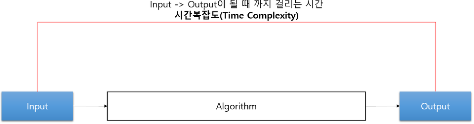

##### FDS

# 컴퓨터공학

## 목차
1. [자료구조](#자료구조) 
2. [알고리즘](#알고리즘)  
3. [소프트웨어 공학](#소프트웨어-공학)

---

## 자료구조
- 자료를 효율적으로 이용할 수 있는 방법론
- 데이터를 구조적으로 표현하는 방식
- 용량을 따져보고 자료를 쌓는다.
- 데이터를 분류해서 배치한다.
- 알고리즘 + 자료구조 --> 환상의 궁합.
- 자바스크립트에서의 클래스

### 자료구조 종류
- 원시구조
	- 정수, 실수, 문자

- 선형구조
	- 배열, 연결 리스트, 스택, 큐, 덱

- 비선형구조
 - 트리, 그래프

- 물리적구조
	- 정수, 실수, 문자
	- 배열, 연결 리스트

### 배열
- 성능이 극도로 중요하는 것은 배열을 이용한다.

### 연결리스트
#### 연결리스트
- 메모리는 데이터마다 공간 주소를 가지고 있다. 다음 친구의 주소를 저장하고 있다.
- 데이터 주소와 데이터 주소사이에 새로운 데이터를 넣고 싶을때

#### 연결리스트 종류
- 단순 연결 리스트
	- 시작과 끝이 정해져 있다.

- 이중 연결 리스트
	- 앞에 친구와 뒤에 있는 친구의 주소를 모두 알고 있는 구조
	- 공간을 낭비하는 단점이 있다.

- 원형 연결 리스트
	- 순환고리가 필요하다.

### 스택(Stack)
- 후입후출
	- 스택에다 자료를 맨 마지막에 넣는 것을 PUSH이다.
	- 스택에다 자료를 맨 마지막에 빼는 것을 POP이다.
예) 웹브라우져 사용할때 팝되어서 맨 마지막 페이지 지워지고. 

### 큐(Queue)
- 대기열(선입선출) : 먼저 들어온 것이 먼저 나가는 것

### 덱(Dequeue)
- 스택과 큐는 많이 쓰인다.
- 덱은 간간히 쓰임.

### 트리(Tree)
- 탐색을 용이하기 위해서 트리구조를 많이 사용한다.
- 부모노드를 가지고 있어 위계질서가 있다.

### 그래프(Graph)
- 시작점이 어딘인지 모른다.
- 위계질서가 없다
예) 네비게이션, 빅데이터, 소셜미디어(친구에 친구를 검색한다.)

## 알고리즘
- 문제해결을 위한 절차/방법 (일을 처리하는 순서/방법)
- 대표적 알고리즘 - 정렬, 탐색, 재귀 등
- 어떠한 문제를 해결하기 우한 여러 동작들의 모음.
- 예) 테트리스

### 정렬 알고리즘 비교 영상(컴퓨터는 일정한 순서(규칙)대로 정렬을 한다.)
: 상황에 맞게 데이터 구조를 사용하는 것 처럼 알고리즘도 자료(상황)에 맞게 가지고 있는 데이터의 상태에 따라서 활용한다.

- 선택정렬
	- 전체를 검색하고 제일 작을 것을 찾아 처음에 정렬하고, 다시 전체를 검색하고 두번째 작은 것을 찾아 두번째 정렬하고, 다시 전체를 검색하고 세번째 작을 것을 찾아 세번째 찾는다. (뒤에 있던 작은 것이 빠진 공간에 앞에 있던 큰 것을 교체 하면서 정렬)

- 버블정렬
	- 앞에 있는 것 부터 순차적으로 두개씩 비교해서 큰 것을 뒤로 밀어서 정렬한다.

- 삽입정렬
	- 비교군과 다른 데이터 집단과의 더 작은애들을 앞으로 삽입.

- 병합정렬(Merge Sort)
	- 영역을 나눠 합치면서 정렬하고, 또 영역을 나눠 합치면서 정렬한다.

- 퀵정렬
	- 중간에 하나를 기준을 잡고 작은 애는 왼쪽으로 큰애는 오른쪽으로 정렬
	- 최악의 경우의 수(최악의 성능) 
		- 기준을 어디로 잡아야 할 지 모른다. 
		- 평균값이 중간이라고 보장 할 수 없다.
		- 어떤 수를 중간을 잡는냐에 따라 성능이 다르다.

- 칵테일 쉐이커
- 힙정렬(Heap Sort)

### 알코리즘의 시간 복잡도(Time Complexity)

- input > output이 될 때 까지 걸리는 시간
- 알고리즘이 실행되는데 소요되는 시간분석
- 점근 표기법
	- 대문자 오 표기법(O Notation) - 최악(On²)
		- 아무리 최악이라도 이 정도의 성능을 보일 수 있다.(많이 사용한다.)
	- 오메가 표기법(Ω Nation) - 최선(Ωn²)
	- 세타 표기법(Θ Nation) - 평균(Θn²)

- 정렬 알고리즘의 시간복잡도
	- 선택정렬 - O(n²)
	- 버블정렬 - O(n²)
	- 삽입정렬 - O(n²)
	- 병합정렬 - O(nlogn)
	- 퀴정렬 - O(nlogn)

- 탐색 알고리즘의 시간 복잡도
	- 선형 탐색() - O(n) 
	- 이진 탐색 - O(logn): 트리에서도 중간 값 잡는게 중요하다.

## 소프트웨어 공학
- 소프트웨어의 개발, 운용, 유지보수 및 폐기에 대한 체계적인 접근방법

### 공학이란?
- 유용한 사물이나 환경을 구축하는 것을 목적으로 하는 학문

### 소프트웨어 공학
- 요구공학
- 아키텍처
- 개발방법론
- 테스팅
- 프로세스
- 형상관리
- 프로젝트 관리
- 유지보수

### 소프트웨어 개발 생명주기 모델
- Software Development Life Cycle Model
- 소프트웨어를 어떻게 개발할 것인가에 대한 전체적인 흐름
- 주먹구구식, 폭포수, 프로토타이핑, 나선형

#### 폭포수 모델(Waterfall Model)

- Requirements(요구단계) -> Design(설계단계) -> Implementation(시행단계) -> Verifiction(검증단계) -> Maintenance(유지보수단계)
- 장점:
- 단점: 수정하기 어렵다.

#### 프로토타이핑 모델(Prototyping Model)

요구분석 -> prototype(모델하우스)설계 -> prototype개발 -> prototype평가 -> 구현 -> 인수 및 설치
  ^                                    |
   ------------------------------------
- 프로토타입은 임시모델이나 마찬가지다.
- 단점
	- 중간에 재평가를 해야하기 때문에 시간이 오래 걸린다.
	- 커뮤니케이션 비용이 많이 발생하기 때문에 시간이 지연된다.
	- 프로토타입제작 비용이나 제작 비용이 중복 증가한다.
	- 클라인언트의 요구사항에 따라 임시 모델을 만든다.(인간의 특성)

#### 나선형 모델(piral Model)

### 소프트웨어 개발 방법론
- 소프트웨어를 생산하는데 필요한 반복적인 과정들을 정리한 것
- 구조적 프로그래밍, 개체지향, 고속 개발 방법론, 익스트림 프로그래밍(Agile), 스크럼(Agile), UP...

#### 애자일 개발 프로세스
- 다른 고전적인 방법론과 구별되는 가장 큰 차이점은 less document-oriented, 즉 문서를 통한 개발 방법이 아나라, Code-oriented, 실질적인 코디이을 통한 방법론

- 특정 개발 방법론을 가리크는 말은 아니고 "애자일(Agile = 기민한, 좋은것을 빠르고 낭비없게 만드는 것)" 개발을 가능하게 해 주는 다양한 방법론 전체를 일컫는 말

##### 애자일 소프트웨어 개발 선언
- 개인과 상호작용, 작동하는 소프트웨어, 고객과의 협력

##### 애자일 선언 이면의 원칙
**우리의 최우선 순위**는, 가치 있는 소프트웨어를 일찍 그리고 지속적으로 전달해서 __<b>고객을 만족시키는 것__이다.
비록 개발의 후반부일지라도 **요구사항 변경을 환영하라**. 

#### UML

- 통합 모델링 언어
- Unified Modeling Language
- 표준화된 범용 모델링 언어
- 객체 지향 소프트웨어 집약 시스템을 개발할 때 산출물을 명세화, 시각화

#### TDD
- 테스트 주도 개발
- Test-driven development
- 매우 짧은 개발 사이클을 반복하는 소프트웨어 개발 프로세스

1. 결함을 점검하는 자동화된 테스트 케이스를 작성
2. 케이스를 통과하기 위한 최소한의 양의 코드를 생성
3. 새 코드를 표준에 맞게 리팩토링

#### PDD
- 계획 기반 개발
- Plan-driven development
- 계획을 세우고 그 계획을 실천하는데에 많은 시간과 노력을 할애하는 개발 방법

### 형상관리
- SW개발 및 유지보수 과정에서 발생하는 소스코드, 문서, 인터페이스 등 각종 결과물에 대해 형상을 만들고, 이들 형상에 대한 변경을 체계적으로 관리, 제어하기 위한 활동

### 버전관리
- 형상관리의 일부
- 일반적인 소프트웨어 소스 코드만의 형상을 관리하는 것
- SVN(Subversion), Git, Mercurial,, CVS...

## 참고사이트
- [Sorting Algorithm Animations](https://www.toptal.com/developers/)
- [정렬(Sorting) 알고리즘 O(n^2)](http://gompangs.tistory.com/46)
- [알코리즘 시간 복잡도(Time Complexity)](http://gompangs.tistory.com/31)
- [알고리즘 정렬공식](http://egloos.zum.com/springmvc/v/567671)
- [소프트웨어 개발 프로세스 모델](http://zakarum.tistory.com/entry/%EC%A0%9C3%EC%9E%A5-%EC%86%8C%ED%94%84%ED%8A%B8%EC%9B%A8%EC%96%B4-%EA%B0%9C%EB%B0%9C-%ED%94%84%EB%A1%9C%EC%84%B8%EC%8A%A4-%EB%AA%A8%EB%8D%B8)