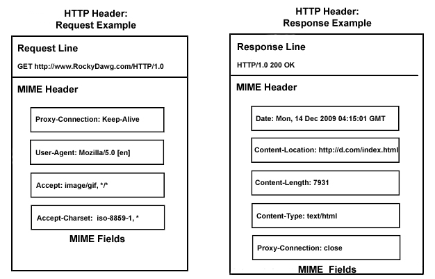
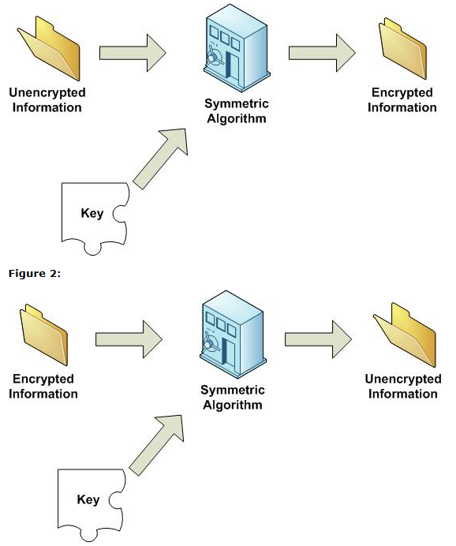
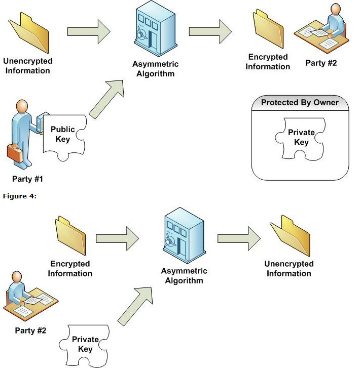

##### DAY03_FDS

# 컴퓨터공학

## 목차
1. [네트워크](#네트워크) 
2. [HTTP](#HTTP)  
3. [암호화](#암호화)

---

## 네트워크

### LAN / MAN / WAN
- LAN(Local Area Network): 근거리 통신망
- MAN(Metropolitan Area Network): 도시권 통신망
- WAN(Wide Area Network): 광역 통신망

### Internet
- 컴퓨터로 연결하여 TCP/IP(Transmission Control Protocol/Internet Protocol)라는 통신 프로토콜을 이용해 정보를 주고받는 컴퓨터 네트워크이다.

### TCP/IP
- TCP(Transmission Control Protocol): 무언가를 주고 받을때 제어하기 위한 전송규약(상호간의 약속)
- IP(Internet Protocol)

### WWW(World Wide Web)
- 구조화된 문서(웹페이지)드리 있는 정보의 저장소
- 분산과 연결

### URI
- Uniform Resource Identifier
- URL(Uniform Resource Locator)는 URI의 한 종류
	- [Protocol]://[Host]:[Port]/[Path]
	- http://www.daum.net:80/map  
		ftp://id:pw@192.168.1.10:777/mydir  
		file://localhost/movie/baseball.avi

### Protocol
- 프로토콜
- 통신규약
- 장비 사이에서 메시지를 주고 받는 양식과 규칙의 체계 즉, 통신(네트워킹) 할 때 정해진 메시지 규치
- http, https, ftp, sftp, telnet, ssh, ssl, smpt...

### HTTP
- Hyper Text Transfer Protocol

### FTP
- File Transfer Protocol

### TELNET
- TErminaL NETwork
- 원격 로그인을 위한 프로토콜
- 암호화 안되어 있다.

### SSH
- Secure Shell
- 네트워크 상의 다른 컴퓨터에 로그인하거나 원격 시스템에서 명령을 실해하고 다른 시스템으로 파일을 복사할 수 있도록 해 주는 응용 프로그램 또는 그 프로토콜
- Telnet의 대용 목적으로 설계
- 암호화 되어 있다.

### SSL
- Secure Socket Layer
- 웹서버와 브라우저 사이의 보안을 위한 프로토콜

### SMTP
- Simple Mail Transfer Protocol
- 전자메일 발송 프로토콜

### Host
- 호스트: 네트워크에 연결된 장치
- 호스트 이름 : 네트워크에 연결된 장치에 부여되어 고유한 이름
에) IP주소, 도메인 주소, MAC 주소 등등

### IP Address
- Internet Protocol Address
- 컴퓨터 네트어크에서 장치들이 서로를 인식하고 통신을 하기 위해서 사용하는 번호
- IPv4(10진수로 표현), IPv6(16진수로 표현)
- 공인아이피는 외부에서 접속하는 아이피이다.

### Domain Address
- 네트워크상에서 컴퓨터를 식별하는 호스트이름.
- 사람이 인식할 수 있는 주소이다.
- 문제점: 컴퓨터는 도메인주소를 인식할 수 없다. 

### DNS
- Domain Name System
- 호스트의 도메인 이름을 호스트의 네트워크 조수로 바꾸거나 그 반대의 변환을 수행

### MAC Address
- Media Access Control Address
- 네트워크 어댑터에 부착된 식별자
- 또, 이더넷 하드웨어 주소(Ethernet hardware address, EHA), 하드웨어 주소, 물리 주소(메모리 물리 주소와 다름)로 부르기도 한다.

### Port
- 가상의 논리적 통신 연결단
- 번호로 구분
- 웹서비스는 80번 Port를 많이 쓴다, https:443 Port
- TCP/UDP의 잘 알려진 서비스 포트 번호 목록 - well known port
	- 잘 알려진 포트(well-known port)는 특정한 쓰임새를 위해서 IANA에서 할당한 TCP 및 UDP 포트 번호의 일부이다. 
	- 일반적으로 포트 번호는 다음과 같이 세 가지로 나눌 수 있다.
		- 0번 ~ 1023번 : 잘 알려진 포트 ( well-known port )
		- 1024번 ~ 49151번 : 등록된 포트 ( registered port )
		- 49152번 ~ 65535번 : 동적 포트 ( dynamic port )
- 물리적인 환경때문에 0과 1을 쓰고있다.

## HTTP

### HTTP란?
- 월드 와이트 웹에서 정보를 주고받을 수 있도록 고안한 프로토콜
- Well-known port: 80 

### HTTP의 역사
- HTTP/0.9 : 1991~
- HTTP/1.0 : 1996~
- HTTP/1.1 : 1997~
- HTTP/2 : 2015~

### HTTP Request / Response
- Request: 클라이언트에서 웹 서버로 요청
- Response: 웹 서버에서 클라이언트로 응답

### HTTP Header / Body
- Header
	- 웹 서버와 클라이언트 사이에서 실질적인 데이터 외에 추가적인 정보를 교환할 수 있도록 선두에 삽입되는 정보
	- 웹 서버와 클라이언트 사이에서 전송할 실질적인 데이터

### HTTP Request Methods
- 웹 서버에 요구하는 작업의 종류에 따라 요청 방법(Request Method)을 구분
- **GET**, **POST**, **PUT**, **DELETE**, HEAD, TRACE, OPTIONS, CONNECT, PATCH등

C | R | U | D
--|---|---|---
Create| Road | Update | Delete
post| get | put | Delete

#### GET
- 요청 URI에 해당하는 자료의 전송을 요청
- Request Body(X)
- Response Body(O)

#### POST
- 서버가 처리할 자료를 전송
- Request Body(O)
- Response Body(O)

#### PUT
- 해당 URI에 자료를 저장
- Request Body(O)
- Response Body(O)

#### DELETE
- 해당 URI에 자료를 삭제
- Request Body(X)
- Response Body(O)

### HTTP Request Status Code
- 1xx: 정보교환/조건부 응답
- 2xx: 성공
- 3xx: 리다이렉션
- 4xx: 요청 오류
- 5xx: 서버 오류

### Cookie
- 서버에 필요한 정보를 클라이언트에 임시/영구적으로 저장하기 위해 사용
- 사용자에 대한 지속적인 상태감시 및 상태참조의 목적
- 여러 페이지를 옮겨 다닐 때에도 통용될 정보에 주로 이용
- 예) 사용자 이름, 아이디, 장바구나, 최근 본 상품 등등

#### Cookie 종류
- 영구적 쿠키
	- 디스크에 저장: 만료일 후에 삭제
- 세션 쿠키
	- 주로 세션 정보를 보관하기 위해 사용
	- 메모리에 저장: 브라우저 종료 후 사라짐

- 악성코드 및 멀웨어에 의해 읽힐 수 있어 보안에 취약
- 보안에 신경쓸 필요가 없으며 간단한 데이터를 통신간에 유지하기 위해 사용

### Session
- 웹 서버가 HTTP 요청을 한 클라이언트를 식별하기 위해 사용
- 클라이언트의 최초 요청에 세션 쿠키로 임의의 난수를 생성
- 클라이언트의 이후 요청에 세션 ID를 헤더에 담아 보내면 서버에서는 이를 통해 클라이언트를 식별
- 서버에 부담이 조금 더 갈 수 있지만 안전하게 정보를 처리 할 수 있다.

### Cache
- 통상적 의미: 데이터나 값을 미리 복사해 놓는 임시 장소
- 웹 서버: 클라이언트 모델에서의 캐싱
	- 서버: 클라이언트 간 요청에 대한 응답을 저장해 두는 것
	- 서버의 부하와 접속 속도 문제 완화
	- 새로운 데이터의 갱신 문제
- html이나 자바스크립트 코드 정도.

### HTTP/2
- 현재 많이 사용되고 있는 HTTP/1.1을 개선하기 위한 차기 버전
- 아직 많이 사용되지 않고 있지만 곧 확작될 예정

#### Why HTTP/2?
- 헤더 압축 지원
	- 쿠키의 과다 사용
	- HTTP/1.1의 헤더는 너무 크고 복잡
	- 속도 저하의 원인
- 너무 빈번한 Round-trip
	- 한 번의 요청으로 다양한 데이터 응답 가능

### 패킷
- 패킷이란 원래 우체국에서 취급하는 "소포"를 말하는데, 화물을 적당한 크기로 분할해서 행선지를 표시하는 꼬리표를 붙인 형태이다. 데이터 통신망에서 말하는 패킷이란, 데이터와 호 제어 신호가 포함된 2 진수, 즉 비트 그룹을 말하는데, 특히 패킷교환 방식에서 데이터를 전송할 때에는 패킷이라는 기본 전송 단위로 데이터를 분해하여 전송한 후, 다시 원래의 데이터로 재조립하여 처리한다. 
- 전자우편이나 HTML 파일, GIF 파일, 기타 어떤 종류의 파일이라도, 이것을 인터넷을 통해 한 장소에서 다른 장소로 보내려 할때, TCP/IP의 TCP 계층은 이 파일을 전송하기에 효율적인 크기로 자르게 된다. 분할된 각 패킷들에는 각각 별도의 번호가 붙여지고 목적지의 인터넷 주소가 포함되며, 각 패킷들은 인터넷을 통해 서로 다른 경로를 통해 전송될 수 있다. 보내어진 패킷들이 모두 도착하면, TCP 계층의 수신부에서 패킷들을 원래의 파일로 다시 재조립한다.
- 이와 같이 패킷교환 방식은 인터넷과 같은 비연결형 네트웍에서 데이터 전송 처리를 하기 위한 효율적인 방법 중의 하나이다. 또 다른 방식의 하나인 회선교환 방식은 음성 전송을 위한 네트웍이다. 회선교환에서도 네트웍 내의 회선들을 많은 사용자들이 공유한다는 측면에서는 패킷교환 방식과 마찬가지지만, 일단 특정한 경로가 설정되면 각 연결은 일정기간 동안에는 거기에 전념하여 서비스를 한다는 측면이 다르다.

### 소켓
- 실시간 서버와 클라이언트간에 서로 수로를 만들고 통신(감시)를 한다.
- 비용이 많이 든다.
- 관리하기 까다롭기 때문제 현재는 많이 추구를 하지 않는다.(예전에 게임, 채팅에 사용했다.)
- 서버의 부하를 줄여기주위해서 대체하는 통신이 플링이다.

## 암호화

### 암호화 기법
- 해시
- 대칭키
- 공개키(비대칭키)

### 해시 함수
- 임의의 데이터(암호 등)를 고정된 길이의 데이터로 매핑하여 원래의 입력값과의 관계를 찾기 어렵게 만든 것
- SHA, MD5 등

### 대칭키 암호화
- 암호화와 복호화에 같은 암호키를 쓰는 알고리즘
- 대칭키는 암호화, 복호화 키가 동일하다. 키를 소유한 사람은 누구든지 복호화 할 수 있다.
- DES, AES, SEED 등
- 비대칭키의 보조도구
- 인증서 방식은 대칭키 암호화 방식인데 암호키를 개인이 가지고 있어 노출이 위험하다.

### 공개키(비대칭키) 암호화
- 공개키로 암호환된 데이터를 비밀키를 사용하여 복호화 할 수 있는 암호화 알고리즘
- 공개키, 개인키라 불리는 2개의키가 사용되는 알로리즘이다. 공개키는 글자 그대로 공개되어 있는 키로 다른 사용자가 암호화를 하여 나에게전달 하고자 할 때 공개키를 이용해서 암호화 한다. 개인키는 공개키로 암호화된 데이터를 복호화 하는데사용되는 키이다. 개인키는 안전하게 보관해야 하며 공유되어서는 안된다.
- RSA 등
- 단점: 알고리즘 자체가 복잡하고 연산이 많이 들어간다. 시스템에서 자원을 많이 소모한다.
- https 방식에서 쓰인다. 인증기간에서 한번 더 물어보게 한다. 안전한 방식이다.
- 비밀키는 대칭키를 사용한다. 

- https 통신방식은 자체 암호화가 돼있기 때문에 사실 인증서가 필요없다. 그러나 우리나라에서 인증서가 쓰이는 이유는 정부 법때문이다.(인증서 수수료는 인증서 기간에서 가져가는 이익집단 있다.)