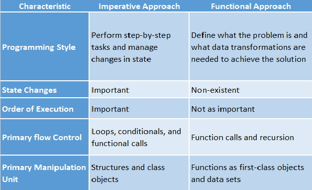

##### DAY04_FDS

# 컴퓨터공학

## 목차
1. [프로그래밍 언어](#프로그래밍 언어) 
2. [객체지향 프로그래밍 패러다음](#객체지향 프로그래밍 패러다임)  

---

## 프로그래밍 언어
[네이버API](https://developers.naver.com/docs/utils/shortenurl/)

### 프로그래밍 언어의 종류
#### 고급언어에서 저급언어로 변환되는 과정에 따른 분류
	1. 컴파일 언어
		- 코드를 0,1 변환해주는 컴파일러(고급언어를 저급언어로 변환)가 있다.
		- 실행되기전에 0과 1로 번역이 되어 이대로 사용자들에게 배포
		- 번역본을 가지고 배포, 컴파일러는 오류 수정시 또는 코드 수정해서 전체 다시 컴파일해 배포(오류난 코드 그대로 배포할 될 수 있다.)
		- 번역가가 이미 통체로 번역해 놓았기 때문에 실행속도가 빠르다.
		- 생산성이 좋지가 않다.하나의 프로그램이 완벽하게 해석되어야 문법적 오류를 찾을 수 있다.
		- 게임(C++, C#), 포토샵, 캐드
		- C, C++, GO...
		- IOS
	2. 바이트코드 언어
		- 컴파일언어와 인터프리터 언어의 장점만 합친 언어
		- 고급언어에서 중간언어로 실행중에 변역해서 배포
		- 중간번역관(JVM: 자바가상머신)이 필요하다.
		- 생산성이 좋다. 환경마다 다 다른코드를 짤 필요가 없다.
		- 배포를 하면 돌이킬 수 있다.
		- Java, C#...
		- 안드로이드
	3. 인터프리터 언어
		- 실시간 번역
		- 0과 1로 변환하는 언어
		- 실행되기 전까지 코드 그대로 있다가 실행해면 0과 1로 변환
		- 유지보수 강점
		- 실행할때 마다 한줄 한줄 0과 1로 번역하여 배포하기 때문에 느리고 리소스가 많이 차지 한다. (번역가가 항상 따라다닌다
		- BASIC, JavaScript, Python, Ruby...

#### 프로그래밍 패러다임에 따른 분류
	- 객체지향 프로그래밍 패러다임
		- JavaScript, Objective-C, Python, Swift, C++, C#, Perl, Ruby, Java...
	- 함수형 프로그래밍 패러다임
		- JavaScript, Python, Swift, C++, C#, Perl, Ruby, Java...

#### 프로그래밍 패러다임
	- 프로그래밍의 관점
		- 객체지향 프로그래밍 패러다임
			- 프로그램을 상호작용하는 객체들의 집합으로 표현
		- 함수형 프로그래밍 패러다임
			- 프로그램을 상태값을 지나지 않는 함수값들의 연속으로 표현

#### Server / Client
	- 서버 (데이터제공)----> 클라이언트

#### Front-end / Back-end
	- 프로그램
		: 서버(back-end <-> Front-end(API)) <----> 클라이언트

#### Thread
	- 어떠한 프로그램 내에서, 특히 프로세스 내에서 실행되는 흐름의 단위를 말한다. 일반적으로 한 프로그램은 하나의 스레드를 가지고 있지만, 프로그램 환경에 따라 둘 이상의 스레드를 동시에 실행할 수 있다.

#### 멀티 스레드
	- Multi Thread - 다중 스레드
	- 멀티 스레트 VS 멀티 태스크
		- 멀티 태스크 : 여러개의 프로세스 동시에 실행.(음악, 인터넷, 게임을 동시에 실행)
		- 멀티 스레드 : 하나의 프로세스(Process)안에서 동시에 여러가지 일을 실행하는 것(에니메이션 스레드, 읽어주기 스레드)

#### Library
	- 특정 기능을 수행할 수 있는 클래스 토는 함수의 집합체
		- 수학 라이브러리
		- 애니메이션 라이브러리
		- 문자열 라이브러리
		- jQuery도 라이브러리(Dom을 기능적으로 사용할 수 있다.)

#### API
	- Application Programming Interface(응용 프로그램 프로그래밍 인터페이스)
	- 응용 소프트웨어 프로그래밍 접합부
	- 응용 소프트웨어와 프레임워크 사이의 중간매체(방법)
	- 소프트웨어 간의 통신을 위해 메시지를 전달하는 방식 등이 결정된 것

#### Framework
	- 구조적으로 고정된 부분을 재사용 할 수 있도록 하고, 응용별 특정 기능을 추가적인 사용자 작성 코드에 의해 선택적으로 구현 가능하도록 하는 포괄적인 추상 구조, 그리고 이를 지원하는 소프트웨어 플랫폼. 기반시설이 다 만들어져 있는 환경
	- Module 8, Angular, Ember, Backbone...

#### 비유해 보자면
	- 프레임워크 - 국가(정부)(예: 기반시설이 다 만들어져 있는 환경)
	- 프레임워크 하위 프레임워크 - 정부부처
	- API - 국가기관
	- 라이브러리 - 직무 전문가(예: 공장에 전문가를 들여와 일을 시키는 것)
	- 프로그래밍 언어 - 국가 통용 언어
	- 레퍼런스 문서 - 국가 조직도 및 기능 설명서

#### Module 8 Framework + JS
	- Module 8라는 나라 모양에 내가 원하는 일을 할 수 있는 기업을 세우는 것
	- Module 8라는 나라에서 JavaScript이라는 언어를 통해 의사 소통 할 수 있다.

### 디자인 패턴
	- 프로그램 개발에서 자주 나타나는 과제를 해결하기 위한 방법 중 하나
	- 과거의 소프트웨어 개발 과정에서 발견된 설계의 노하우에 이름을 부여 이후에 재이용하기 좋은 형태로 묶어서 정리한 것
	- **코드구조의 설계 방식**
	- 프로그램 뼈대를 만드는 설계 노하우

	- MVC(Model-View-Controller)
	- MVVM(Model-View_ViewModel)
	- Observer
	- Singleton
	- Prototype

#### MVC Design Pattern

#### Reference Document
	- 레퍼런스 문서
	- API에 대해 서술해 놓은 문서

## 객체지향 프로그래밍 패러다임

### 객체지향 프로그래밍
	- Object-Oriented Programming, OOP
	- 프로그래미 패러다임 중 하나
	- 컴퓨터 프로그램을 명령어의 목록으로 보는 시각에서 벗어나 여러 개의 독립된 단위, 즉 '객체'들의 모임으로 파악하고자 하는 것이다. 각각의 객체는 메시지를 주고받고, 데이터를 처리할 수 있다. 
	- 객체 : 의식과 행위를 가지는 형태

### 기본 구성 요소

- 클래스(Class) 
	- 같은 종류(또는 문제 해결을 위한)의 집단에 속하는 **속성(attribute)과 행위(behavior)를 정의**한 것으로 객체지향 프로그램의 기본적인 사용자 정의 데이터형(user define data type)이라고 할 수 있다. 클래스는 프로그래머가 아니지만 해결해야 할 문제가 속하는 영역에 종사하는 사람이라면 사용할 수 있고, 다른 클래스 또는 외부 요소와 독립적으로 디자인하여야 한다.
	- 템플릿, 설계도

- 객체(Object) 
	- 클래스의 인스턴스(실제로 메모리상에 할당된 것)이다. 객체는 자신 고유의 속성(attribute)을 가지며 클래스에서 정의한 행위(behavior)를 수행할 수 있다. 객체의 행위는 클래스에 정의된 행위에 대한 정의를 공유함으로써 메모리를 경제적으로 사용한다.

- 메서드(Method), 메시지(Message) 
	- 클래스로부터 생성된 객체를 사용하는 방법으로서 객체에 명령을 내리는 메시지라 할 수 있다. 메서드는 한 객체의 서브루틴(subroutine) 형태로 객체의 속성을 조작하는 데 사용된다. 또 객체 간의 통신은 메시지를 통해 이루어진다.

#### 클래스와 객체
- 실질적인 형태(클래스의 객체화)
- 클래스 --> 객체
- 메모리안에 객체들이 서로 상호작용하며 운영되고 있다.

#### Class -> Object

### 특징
객체 지향 프로그래밍의 특징은 기본적으로 자료 추상화, 상속, 다형 개념, 동적 바인딩 등이 있으며 추가적으로 다중 상속 등의 특징이 존재한다. 객체 지향 프로그래밍은 자료 추상화를 기초로 하여 상속, 다형 개념, 동적 바인딩이 시스템의 복잡성을 제어하기 위해 서로 맞물려 기능하는 것이다.

#### 자료 추상화
- 자료 추상화는 불필요한 정보는 숨기고 중요한 정보만을 표현함으로써 프로그램을 간단히 만드는 것이다. 자료 추상화를 통해 정의된 자료형을 추상 자료형이라고 한다. 추상 자료형은 자료형의 자료 표현과 자료형의 연산을 캡슐화한 것으로 접근 제어를 통해서 자료형의 정보를 은닉할 수 있다. 객체 지향 프로그래밍에서 일반적으로 추상 자료형을 클래스, 추상 자료형의 인스턴스를 객체, 추상 자료형에서 정의된 연산을 메소드, 메소드의 호출을 메시지라고 한다.

- 상속
 - 상속은 새로운 클래스가 기존의 클래스의 자료와 연산을 이용할 수 있게 하는 기능이다. 상속을 받는 새로운 클래스를 부클래스, 파생 클래스, 하위 클래스, 자식 클래스라고 하며 새로운 클래스가 상속하는 기존의 클래스를 기반 클래스, 상위 클래스, 부모 클래스라고 한다. 상속을 통해서 기존의 클래스를 상속받은 하위 클래스를 이용해 프로그램의 요구에 맞추어 클래스를 수정할 수 있고 클래스 간의 종속 관계를 형성함으로써 객체를 조직화할 수 있다.

- 다중 상속
 - 다중 상속은 클래스가 2개 이상의 클래스로부터 상속받을 수 있게 하는 기능이다. 클래스들의 기능이 동시에 필요할 때 용이하나 클래스의 상속 관계에 혼란을 줄 수 있고(예: 다이아몬드 상속) 프로그래밍 언어에 따라 사용 가능 유무가 다르므로 주의해서 사용해야 한다. JAVA는 지원하지 않는다.

- 다형성 개념[편집]
	- 다형성 개념이란 어떤 한 요소에 여러 개념을 넣어 놓는 것으로 일반적으로 오버라이딩(같은 이름의 메소드가 여러 클래스에서 다른 기능을 하는 것)이나 오버로딩(같은 이름의 메소드가 인자의 갯수나 자료형에 따라서 다른 기능을 하는 것)을 의미한다. 다형 개념을 통해서 프로그램 안의 객체 간의 관계를 조직적으로 나타낼 수 있다.

- 동적 바인딩[편집]
	- 동적 바인딩은 실행 시간 중에 일어나거나 실행 과정에서 변경될 수 있는 바인딩으로 컴파일 시간에 완료되어 변화하지 않는 정적 바인딩과 대비되는 개념이다. 동적 바인딩은 프로그램의 한 개체나 기호를 실행 과정에 여러 속성이나 연산에 바인딩함으로써 다형 개념을 실현한다.

### 장점
소프트웨어 공학의 관점에서 볼 때 S/W의 질을 향상하기 위해 강한 응집력(Strong Cohesion)과 약한 결합력(Weak Coupling)을 지향해야 하는데, OOP의 경우 클래스에 하나의 문제 해결을 위한 데이터를 모아 놓은 데이터형을 사용함으로써 응집력을 강화하고, 클래스간에 독립적으로 디자인함으로써 결합력을 약하게 할 수 있다.

## 함수형 프로그래밍 패러다임

### OPP_vs_Functional_Programming

### 객체지향 프로그래밍
	- 객체지향 프로그래밍에서 객체는 속성과 행위를 가집니다.
	- 만약, 여러 스레트에서 객체의 속성을 동시에 접근하려고 한다면?
	- 상태값(예: 도넛츠의 맛)이 있기 때문에 thread Lock이 필요하다.

### 함수형 프로그래밍
	- 프로그램이 상태의 변화 없이 데이터 처리를 수학적 함수 계산으로 취급하고자 하는 패러다임
	- 클래스가 없다.
	- 상태값이 없기때문에 thread Lock이 필요없다.
	- 대규모 병렬시스템
