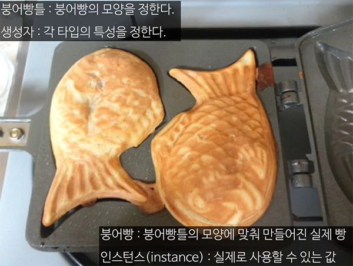
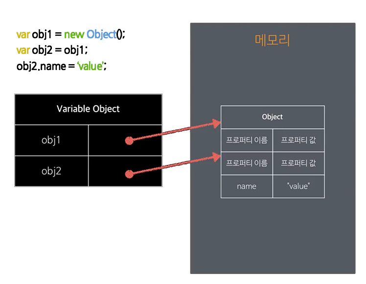

# JAVASCRIPT  Lesson 2

## 원시 자료형

### 문자열(String)
- `ES6`(정식명칭 ES2015) backtick문자(`)로 묶으면 템플릿 문자열이 된다.
```javascript
var name = "김영선";
"안녕하세요, " + name + "님";	// "안녕하세요, 김영선님"
`안녕하세요, ${name}님`;	// "안녕하세요, 김영선님"
```

- `ES6`템플릿 문자열 안에서 표현식도 사용할 수 있다.
```javascript
var num = 30;
"인생은 " + (num * 2) + "부터";		// "인생은 60부터"
`인생은 ${num * 2}부터`;		// "인생은 60부터"
```

### 불리언(Boolean)
- true또는 false 라는 값을 가지는 자료형
- 두 값을 비교하거나 어떤 값을 부정(!)하면 불리언 값이 된다.
- 빈문자열(" ")만 false고 그 나머지는  true이다.
- 모든 숫자(음수, 양수) 중에 0(false)만 제외하곤 true이다.
- 숫자 중에서 NaN은 false이다.
- 조건식에서 쓰인다.
```javascript
var num1 = 10, num2 = 20;
num1 < num2;	// true
num1 > num2;	// false
num1 == num2;	// false
!true	// false
!10		// false 
!0		// true

!""		// true
!"0"	// false

!guess	// false
!!guess	// true

![]		// false
+![]	// 0 (+를 붙이면 숫자로 바뀐다.)
+true	// 1
```

### null
- 아무 것도 없이 비어있는 값을 가리킨다.
```javascript
var obj = null; // obj에는 아무 값도 없다.
```
- 원시 자료형 중 특이하게 typeof 연산자를 사용한 결과가 "object"로 나타난다.

### undefined
- 변수를 선언하고 아무런 값도 할당하지 않을 때의 기본값
```javascript
var name;	// undefined
```

- 직접 할당할 수도 있다.
```javascript
var name = undefined;
```

- undefined는 예약어가 아니라서 다른 값을 할당해도 문법 에러가 발생하지 않는다.

### 객체(Object)
- 자바스크립트의 모든 값을 `객체처럼` 다루어진다.

> **객체** <br>
> 각 타입마다 고유한 `속성`(프로퍼터: property)과 `실행 동작`(메소드: method)이 있다.

```javascript
var 문자열 = "프론트엔드 갬프";
문자열.length;	// 8
문자열.indexOf('캠프');	// 6
			  		// 0프1론2트3엔4드5 6캠7프(문자 사이사이 index 번호가 있다고 생각한다.)
```

- 각 타입에는 타입의 성격을 정하는 생성자(constructor)가 있다.
- 예를 들어, 앞서 배웠던 숫자는 Number라는 생성자가 있고,
문자열은 String이라는 생성자가 있다.
- 생성자의 이름은 대문자로 시작하는 관례가 있다.
- 각 프로퍼티와 메소드에는 고유한 이름과 값이 있다.
  

	> 생성자: 각 타입의 특성을 정한다.<br>
	> 인스턴스(instance): 실제로 사용할 수 있는 값

## 객체 자료형
- 참조 자료형(Reference Type)이라고도 부른다.
- 객체 자료형의 값은 객체의 인스턴스(instance)이다.
- 객체값은 순서가 없는 프로퍼티(peroperty)로 이루어지며, 프로퍼티는 문자열인 이름과 값으로 구성되어 있다.
- new 연산자를 사용해 인스턴스로 만든다.
```javascript
var name = new Object(); // Object는 생성자 이다.
```
- typeof 연산자를 사용하면 대체로 `"object"`가 반환된다. (단, 함수는 "function", 정규표현식 "regexp" 반환)
- 변수에 저장 후 다른 변수로 복사해도 참조(= 연결고리)만 복사되고, 값 자체를 복제하지는 않는다.
따라서, 복사된 값을 변경하면 원래 값도 변경된다.(메모리에서 같은 곳을 가리키기 때문이다.)
```javascript
var obj1 = new Object();
var obj2 = obj1;
obj1;	// Object {}
console.log(obj1);	// Object {}

obj2.name = 'value';
obj2;	// Object {name: "value"}
obj1;	// Object {name: "value"}
```
  
	
- instanceof 연산자를 통해 생성자 - 인스턴스의 관계를 알 수 있다.
```javascript
var arr = new Array();
arr instanceof Array	// true --> Array(생성자이름)
```

## 배열(Array)
