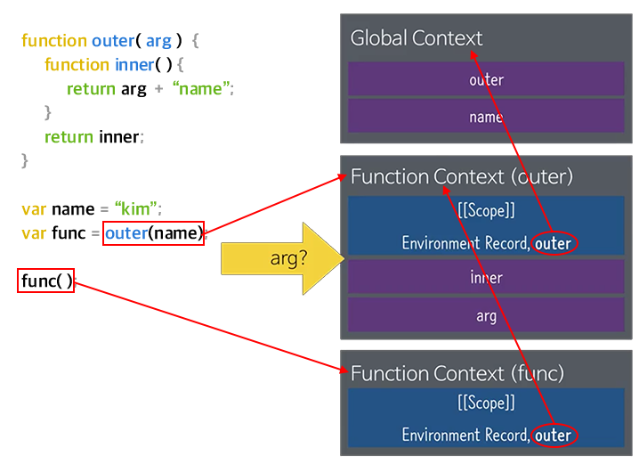

# JAVASCRIPT  Lesson 2

## 원시 자료형

### 문자열(String)
- `ES6`(정식명칭 ES2015) backtick문자(`)로 묶으면 템플릿 문자열이 된다.
```javascript
var name = "김영선";
"안녕하세요, " + name + "님";  // "안녕하세요, 김영선님"
`안녕하세요, ${name}님`;  // "안녕하세요, 김영선님"
```

- `ES6`템플릿 문자열 안에서 표현식도 사용할 수 있다.
```javascript
var num = 30;
"인생은 " + (num * 2) + "부터";  // "인생은 60부터"
`인생은 ${num * 2}부터`;  // "인생은 60부터"
```

### 불리언(Boolean)
- true또는 false 라는 값을 가지는 자료형
- 두 값을 비교하거나 어떤 값을 부정(!)하면 불리언 값이 된다.
- 빈문자열(" ")만 false고 그 나머지는  true이다.
- 모든 숫자(음수, 양수) 중에 0(false)만 제외하곤 true이다.
- 숫자 중에서 NaN은 false이다.
- 조건식에서 쓰인다.
```javascript
var num1 = 10, num2 = 20;
num1 < num2;	// true
num1 > num2;	// false
num1 == num2;	// false
!true	// false
!10		// false 
!0		// true

!""		// true
!"0"	// false

!guess	// false
!!guess	// true

![]		// false
+![]	// 0 (+를 붙이면 숫자로 바뀐다.)
+true	// 1
```

### null
- 아무 것도 없이 비어있는 값을 가리킨다.
```javascript
var obj = null;  // obj에는 아무 값도 없다.
```
- 원시 자료형 중 특이하게 typeof 연산자를 사용한 결과가 "object"로 나타난다.

### undefined
- 변수를 선언하고 아무런 값도 할당하지 않을 때의 기본값
```javascript
var name;  // undefined
```

- 직접 할당할 수도 있다.
```javascript
var name = undefined;
```

- 배열을 선언하고 값을 넣지 않으면 undefined가 나온다. 
- 배열에서 공간만 잡아 넣고 값을 채우지 않으면 undefined가 나온다. 
```javascript
- var arr2 = new Array(10);  // 크기가 10인 배열 --> [undefined × 10] undefined가 쭉 10 개 들어있다는 뜻
```
- undefined는 예약어가 아니라서 다른 값을 할당해도 문법 에러가 발생하지 않는다.

### 객체(object)
- 자바스크립트의 모든 값을 `객체처럼` 다루어진다.

> **객체** <br>
> 각 타입마다 고유한 `속성`(프로퍼터: property)과 `실행 동작`(메소드: method)이 있다.

```javascript
var 문자열 = "프론트엔드 갬프";
문자열.length;  // 8
문자열.indexOf('캠프');  // 6
			  		// 0프1론2트3엔4드5 6캠7프(문자 사이사이 index 번호가 있다고 생각한다.)
```

- 각 타입에는 타입의 성격을 정하는 생성자(constructor)가 있다.
- 예를 들어, 앞서 배웠던 숫자는 Number라는 생성자가 있고,
문자열은 String이라는 생성자가 있다.
- 생성자의 이름은 대문자로 시작하는 관례가 있다.
- 각 프로퍼티와 메소드에는 고유한 이름과 값이 있다.
  

	> 생성자: 각 타입의 특성을 정한다.<br>
	> 인스턴스(instance): 실제로 사용할 수 있는 값

## 객체 자료형
- 참조 자료형(Reference Type)이라고도 부른다.
- 객체 자료형의 값은 객체의 인스턴스(instance)이다.
- 객체값은 순서가 없는 프로퍼티(peroperty)로 이루어지며, 프로퍼티는 문자열인 이름과 값으로 구성되어 있다.
- new 연산자를 사용해 인스턴스로 만든다.
```javascript
var name = new Object();  // Object는 생성자 이다.
```
- typeof 연산자를 사용하면 대체로 `"object"`가 반환된다. (단, 함수는 "function", 정규표현식 "regexp" 반환)
- 변수에 저장 후 다른 변수로 복사해도 참조(= 연결고리)만 복사되고, 값 자체를 복제하지는 않는다.
따라서, 복사된 값을 변경하면 원래 값도 변경된다.(메모리에서 같은 곳을 가리키기 때문이다.)
```javascript
var obj1 = new Object();
var obj2 = obj1;
obj1;  // Object {}
console.log(obj1);  // Object {}

obj2.name = 'value';
obj2;  // Object {name: "value"}
obj1;  // Object {name: "value"}
```

- 참조타입
```javascript
var arr1 = [10, 20, 30];
arr2 = arr1;

arr2[2] = 100;

console.log(arr1);  // [10, 20, 100]
console.log(arr2);  // [10, 20, 100]

arr2 == arr1;  // true

var arr3 = [10, 20, 30];
arr1 == arr3;  // false --> 메모리에서 가리키는 값이 다르다.
```


- instanceof 연산자를 통해 생성자 - 인스턴스의 관계를 알 수 있다.
```javascript
var arr = new Array();
arr instanceof Array  // true --> Array(생성자이름)
```

### 배열(Array)
- Array타입
- 여러 값을 하나의 이름으로 묶어두고 사용할 수 있다.
```javascript
var 장볼거1 = '돼지고기';
var 장볼거2 = '대파';
var 장볼거3 = '당근';
var 장볼거4 = '당면';

var 장볼거 = new Array('돼지고기', '대파', '당근', '당면');
```

- 배열의 각 값을 **원소(element)**라고 부른다.
- 배열의 크기는 .length프로퍼티를 통해 알 수 있다.
```javascript
console.log(장볼거.length);  // 4
```

- 생성자에 숫자를 한 개만 넣으면 배열의 크기가 되지만,
여러 개를 넣으면 배열의 원소가 된다.
```javascript
var arr1 = new Array();  // 크기가 0인 배열
var arr2 = new Array(10);  // 크기가 10인 배열 --> [undefined × 10] undefined가 쭉 10 개 들어있다는 뜻
var arr3 = new Array(10, 20, 30);  // 원소가 3개인 배열
```

- 배열은 리터럴 표현이 있다.
```javascript
var arr4 = [];  // 원소가 없는 배열
var arr5 = [10, 20, 30];  // 원소가 3개인 배열
```

-  각괄호 + 인덱스를 통해 각 원소에 접근할 수 있다.
```javascript
var arr5 = [10, 20, 30];  // 원소가 3개인 배열
arr5[0];  // 10
```
- 각괄호를 통해 특정 위치에 원소를 저장 할 수도 있다.
```javascript
var arr = [10, 20, 30];
arr[1] = 50;  // 10, 50, 30

arr[10] = 100;
arr;  // [10, 50, 30, undefined × 7, 100]
```
- 명시적으로 자리를 만들았던 만들지 않았던 이미 배열은 만들었지만 배열의 범위를 넘어서는 자리를 접근해도 undefined가 나온다.
- 변수는 만들지 않고 접근하면 에러가 나오는데 배열은 안그렇다. 만들지 않은 인덱스에 접근해도 에러는 안나오고 단지 undefined가 나온다. 
<br>
- 리터럴 생성과 원소에 접근할 수 있다.
```javascript
[10, 20, 30][1];  // 20
[1][1];  // undefined
[1][0];  // 1
```
- 활용도가 높은 메소드: [concat( )](https://developer.mozilla.org/ko/docs/Web/JavaScript/Reference/Global_Objects/Array/concat), [filter( )](https://developer.mozilla.org/ko/docs/Web/JavaScript/Reference/Global_Objects/Array/filter), [forEach( )](https://developer.mozilla.org/ko/docs/Web/JavaScript/Reference/Global_Objects/Array/forEach), [indexOf( )](https://developer.mozilla.org/en-US/docs/Web/JavaScript/Reference/Global_Objects/Array/indexOf), [join( )](https://developer.mozilla.org/ko/docs/Web/JavaScript/Reference/Global_Objects/Array/join), [map( )](https://developer.mozilla.org/en-US/docs/Web/JavaScript/Reference/Global_Objects/Array/map), [pop( )](https://developer.mozilla.org/en-US/docs/Web/JavaScript/Reference/Global_Objects/Array/pop), [push( )](https://developer.mozilla.org/en-US/docs/Web/JavaScript/Reference/Global_Objects/Array/push), [reverse( )](https://developer.mozilla.org/en-US/docs/Web/JavaScript/Reference/Global_Objects/Array/reverse), [shift( )](https://developer.mozilla.org/en-US/docs/Web/JavaScript/Reference/Global_Objects/Array/shift), [slice( )](https://developer.mozilla.org/ko/docs/Web/JavaScript/Reference/Global_Objects/Array/slice), [sort( )](https://developer.mozilla.org/en-US/docs/Web/JavaScript/Reference/Global_Objects/Array/sort), [unshift( )](https://developer.mozilla.org/en-US/docs/Web/JavaScript/Reference/Global_Objects/Array/unshift)

#### join()
- join()은 배열을 문자열로 만든다.
```javascript
var arr = [10, 20, 30];
arr.join('+');  // "10+20+30" --> join()은 배열을 문자열로 만든다.
arr.length;  // 3
arr;  // [10, 20, 30]

arr.length = 2;  // length에 다른 값을 넣을 수 있다. 그럼 크기가 달라진다.
arr;  // [10, 20]

arr.length = 0; 	
arr;  // []

arr.length = 10;
arr;  // [undefined * 10]
```
#### slice()
- slice (시작index, 마지막index3): 마지막 인덱스 이후부터 잘라낸다. 인덱스는 사이 사이에 있다.
- 마지막 index는 생략할 수 있다.
```javascript
arr = [10, 20, 30, 40, 50];
arr.slice(2, 3);  // [30]	--> slice는 (시작index, 마지막index3)
arr.slice(2, 4);  // [20, 40
arr.slice(2);  // [30, 40, 50] --> 마지막index는 생략할 수 있다.
```

### 오브젝트(Object)  타입
- 객체지향일때의 복잡한 참조타입을 부를때는 객체(소문자 object)  VS  자바스크립트 내의 타입 중 Object(대문자) 타입으로 구분된다.
- 한 그룹으로 묶을 수 있는 값, 각 값에는 고유한 이름이 있다.(배열은 Array타입 각각 원소 지칭하는 번호는 있어도 이름은 없다. )

> new Object([value])

```javascript
var 강사 = new Object();
강사.이름 = "김태곤";
강사.성별 = "남자";
강사.이름  // "김태곤"
```
- 사실, 여기서 각 값은 오브젝트 타입 값의 프로퍼티이다.
- 프로퍼티의 이름을 가리켜 `키(key)`라고 부르고, 프로퍼티의 값을 가리켜 `값(value)`이라고 부른다.
<br>
- 리터럴 표현을 사용하면 객체와 프로퍼티를 동시에 만들 수 있다.
```javascript
var obj = {
	키(key): 값(value),
	newPorperty: "value",
	"property": 123
};
```
- 리터럴 표현에서 키와 값 사이에는 콜론을 두어 구분하고, 키-값 쌍끼리는 쉼표를 구분한다.
- 원칙적으로 모든 키는 문자열이므로 따옴표로 묶어줘야 하지만, **변수 이름 규칙을 따른다면**따옴표를 생략 할 수 있다. 
- 점 문법을 통해 프로퍼티에 접근하고 생성한다.
- 변수 이름 규칙에 어긋나면 점 문법을 사용 못한다.(예: 키이름에 @, 키이름에 공백, 기타등등)
```javascript
var obj = new Object();
obj.newProperty = "value";
obj.newProperty // "value"
```
- 각괄호 문법을 통해서도 프로퍼티에 접근하고 생성할 수 있다.
```javascript
obj["newProperty"] = "value";
obj["newProperty"]  // "value"
```
- delete 연산자를 사용해 프로퍼티를 제거할 수 있다.
```javascript
delete obj.newPorperty1;
delete obj["newProperty2"];
```
- in 연산자를 통해 특정 프로퍼티 이름이 객체에 존재하는지 확인 할 수 있다.
```javascript
"propertyName" in Obj  // ture or false
```
- 활용도가 높은 메소드: 'ES6' [Object.assign( )](https://developer.mozilla.org/ko/docs/Web/JavaScript/Reference/Global_Objects/Object/assign),  [Object.create( )](https://developer.mozilla.org/ko/docs/Web/JavaScript/Reference/Global_Objects/Object/create), [Object.defineProperty( )](https://developer.mozilla.org/ko/docs/Web/JavaScript/Reference/Global_Objects/Object/defineProperty), [Object.defineProperties( )](https://developer.mozilla.org/ko/docs/Web/JavaScript/Reference/Global_Objects/Object/defineProperty), [Object.keys( )](https://developer.mozilla.org/en-US/docs/Web/JavaScript/Reference/Global_Objects/Object/keys), [hasOwnProperty( )](https://developer.mozilla.org/ko/docs/Web/JavaScript/Reference/Global_Objects/Object/hasOwnProperty) 
```javascript
var obj = { "number": 123 };
/* in 연산자는 내가 직접 넣었는지 안넣었는지 모른다. 있으면 있는가 보다가 in이다. */
"hasOwnProperty" in obj;  // ture --> obj에는 기본적으로 hasOwnProperty를 가지고 있다.
"number" in obj  // ture

/* hasOwnProperty()는 내가 직접 집어 넣은 것만 찾는다. */
obj.hasOwnProperty("number")  //  ture
obj.hasOwnProperty("hasOwnProperty")  // false
```
- 사실, 자바스크립트의 모든 객체는 Object타입이기도 하다.
- 동시에 각각의 고유의 타입니다.

> **object instanceof constructor**<br>
> object : 테스트 대상인 오브젝트, constructor: 테스트할 함수

```javascript
[] instanceof Array  // true --> Array는
[] instanceof Object  // true
(function(){}) instanceof Object  // true
```
```javascript
var arr = [1, 2, 3];
arr["안녕"] = "하세요";
arr  // [1, 2, 3]
arr.안녕  // "하세요"
'slice' in arr  // true
```
- 따라서 자바스크립트의 모든 값은  Object 타입의 특성도 함께 가지고 있다.

## 함수(Function) :  기능
- function + 공백 + 함수 이름 + 괄호로 선언한다.
```javascript
function 인사(){
	console.log('안녕하세요');
}
```
- 함수 이름 뒤에 괄호를 붙여서 실행한다.
```javascript
인사();
```
- 괄호를 쓰면 실행하고, 괄호를 안쓰면 단순히 "변수"처럼 되고, "값"으로 취급한다.
- 다른 모든 타입은 "값"으로만 취급되지만, 함수는 `"값"`이기도 한 동시에 **"행동" 또는 "기능"** 이기도 하다.
- Object의 특성을 가지고 있다.

> **함수의 목적**
> 여러 차례 반복해야 하는 코드 뭉치를 편리한 이름으로 묶는다.

**라면 끓여줘**
```javascript
함수선언키워드 함수 이름
function 라면끓이기() {
	냄비에넣는다(물550ml, 건더기스프);
	끓인다();
	냄비에넣는다(면, 분말스프);
	끓인다(4분);
	불을끈다();
	그릇에담는다();
}

라면끓이기();
```
**난 더 꼬들하게**
```javascript
				(인수: Argument)
function 라면끓이기(물끓일시간) {
	냄비에넣는다(물550ml, 건더기스프);
	끓인다(물끓일시간);
	냄비에넣는다(면, 분말스프);
	끓인다(4분);
	불을끈다();
	그릇에담는다();
}

라면끓이기(4분);
```
- 함수 안에서 return 키워드를 사용하면 즉시 함수를 종료하고 키워드 뒤에 있는 값을 밖으로 반환한다.
```javascript
function 두배(arg){
	return arg * 2;
};
var num = 두배(3);
```
- 괄호를 붙이지 않으면 "값"으로 취급된다. 복사된 함수도 똑같이 실행할 수 있다.
```javascript
var x2 = 두배;
var num2 = x2(5);
```
- 생성자를 사용하는 방법보다는 리터럴 형식이 일반적이다.
```javascript
var func1 = new Function('arg', 'return arg;'); //  거의 사용안한다.
var func2 = function(arg){
	return arg;
};
```
### 익명함수
- 이름을 주지 않고 만들 수도 있다.
```javascript
function(arg){
	return arg;
}
```
- 가비지컬렉터(만들어도 의미도 없고 바로 사라진다. 아무곳에도 연결되있지 않은 쓸모없는 값들은 바로바로 정리한다. 만들자마자 사라질 운명)
```javascript
(function(){ 
	console.log('안녕');
});	
||
function (){
	console.log('안녕');
}
```
###즉시실행함수
- 한번 만들고 한번 딱 실행하고 메모리에서 지울려고 만드는 함수. 메모리에서 한번 쓰고 지우는 것.
```javascript
(12);  // 12

(function(){ 
	console.log('안녕');
})();  // 안녕 --> ();는 즉시실행함수이다.


var num = 10;
num * 3;  // 30

(function (num){
	return num * 3;
})(10);  // 30

var result = (function (num){
	return num * 3;
})(10);
result;  // 30

var result = (function (num){
	return num * 3;
}(10));
result;  // 30
```
### 함수 안에도 함수를 만들 수 있다.
```javascript
function outer(arg) {
	function inner(a) {
		return a * 2;
	}
	return inner(arg);
}
// outter 함수가 실행되어야 inner 함수가 실행된다.
// 함수안에 있는 코드들은 실행을 해야 의미가 있다.
```
### 스코프(scope)
함수를 실행하면 독립된 컨텍스트(context)(독립된 실행공간, 함수만을 위한 메모리 공간)가 생겨서, 이 때문에 변수와 함수의 스코프(scope)가 정해진다.
```javascript
function outer(arg){
	function inner(){
		return arg + "name";
	}
	return inner;  // inner함수명 옆에 ();를 안쓰면 inner함수자체를 밖으로 빼는(반환하는) 것이다.
}
var name = "kim";
var func = outer(name);  // 변수 func는 함수 outer(name);을 실행한 결과이다. 
			// inner함수가 변수func저장되었기 때문에 func도 함수이다.

func();  // "kimname" --> func함수에 괄호'()'를 붙여 inner함수실행한다.

```



> 1. Global Context
> 	- 자바스크립트는 기본적으로 `전역 컨텍스트`가 하나있다.
> 	- outer와 name이 하나씩 들어가 있다.
> 1. Function context(outer)
> 	- outer(name); 함수를 실행하면 독립된 메모리 공간(Function Context)이 생긴다.  	outer 안에는 arg변수를 선언한 것이나 같다. 인수가 있는것은 변수를 선언한 것과 같다.(arg = name;)
> 	- outer함수를 실행한 결과 값 inner함수와 arg변수(전달받은 값)가 들어가 있다.
> 	- outer함수가 실행하면 나의 부모컨텍스트가 뭔지를  내부적으로 가지고 있다. 		각각의 컨텍스트들은 나의 부모컨텍스트들을 뭔지 알고 있다.
> 1. Function Context(func)
> 	- 여기서 outer는 밖같은 부모 함수이다.

### 클로저(closure)
- 함수도 반환할 수 있다.
- 클로저는 자바스크립트의 강력한 기능 중 하나입니다. 자바스크립트는 함수의 내포화(함수 안에 함수를 정의하는것)를 가능하게 해주고 외부 함수 안에서 정의된 모든 변수와 함수들을 내부 함수가 완전하게 접근 할 수 있도록 승인해줍니다.(다른 외부 함수에서 접근된 모든 변수와 함수들까지) 그러나 외부 함수는 내부 함수 안에서 정의된 변수와 함수들에 접근 할 수 없습니다. 이는 내부 함수의 변수를 보호합니다. 또한 내부 함수가 외부 함수보다 더 오래 쓰이면, 내부 함수가 외부 함수 범위에 접근하고 나서 부터는 외부 함수에서 정의된 변수와 함수는 원래보다 더 오래 쓸수 있습니다. 클로저는 어떤 외부 함수 범위 밖 어딘가에서 내부 함수가 사용 가능하면 생성됩니다.
- 클로저는 함수 내부에 만든 지역변수가 사라지지 않고 계속해서 값을 유지하고 있는 상태를 말한다.
- 변수가 메모리에서 제거되지 않고 계속해서 값을 유지하는 상태를 클로저라고 부르며 내부에 있는 함수를 `클로저 함수`라고 한다. 
```javascript
/* 일반함수인 경우 */
function addCount(){
	var count = 0;  
	count++;
	return count;
}

document.write("1. count = "+addCount(), "<br>");  // 1. count = 1
// addCount()함수가 호출되면 지역변수 count가 0으로 초기화 됨과 동시에 만들어진다. 
// 다음으로 증가 연산자에 의해 1이 되며 이 값을 리턴하기 때문에 1이 출력됩니다. 
// 그리고 모든 구문을 실행한 함수는 종료됩니다. 
// 이와 동시에 함수 내부에 만들어진 count는 메모리에서 흔적조차 없이 사라진다.
document.write("2. count = "+addCount(), "<br>");  // 2. count = 1
document.write("3. count = "+addCount(), "<br>");  // 3. count = 1

/* 클로저를 사용한 경우 */
function creatCounter(){
var count = 0;
	function addCount(){
		count++;
		return count;
	}
	return addCount;
}

var counter = creatCounter();
// createCounter() 함수가 호출되면 지역변수 count가 0으로 초기화됨과 동시에 만들어지니다. 
// 그리고 내부에 addCount()라는 함수도 만들어지고, 
// 마지막 addCount()함수를 리턴하고 creatCounter()함수는 종료됩니다.

document.write("1. count=" + counter(), "<br>");  // 1. count=1
// counter()가 실행되면 addCount()함수가 실행되어 
// 증가 연산자에 의해서 count 값이 0에서 1로 증가하기 때문에 1이 출력된다.
document.write("2. count=" + counter(), "<br>");  // 2. count=2
document.write("3. count=" + counter(), "<br>");  // 3. count=3
```
	
> `creatCounter()`가 종료되더라도 일반 함수처럼 사라지지 않고 계속해서 값을 유지하고 있다.<br>
> 이유는 바로 `addCounter()`함수 내부에 `count` 변수를 사용하고 있는 상태에서 외부로 리턴되어 클로저 현상이 발생하기 때문이다. 

### 호이스팅(hoisting)
- 변수와 선언된 함수는 가장 먼저 정의된 듯 동작한다.
- 자바스클립트 해석기는 함수 내에 있는 변수 선언과 함수 선언을 먼저 처리하는데, 이 때문에 선언이 함수 가장 앞에 있는 듯한 `호이스팅(hoisting)` 현상이 발생한다.
```javascript
function outer(arg){
	console.log(value);  // undefined
	function inner(){
		return arg + "name";
	}
	var value = 'hello';	
	return inner;
}

var func = outer("kim");

func();  // "kimname"

/* 위 코드를 실제 내부적으로 봤을경우 */
function outer(arg) {
	var arg, value;
	function inner() {
		return arg + "name";
	}
		console.log(value);  // undefined
	value = 'hello';
	
	return inner;
}

var func = outer("kim");
```
### argument (인수)
- 함수 안에는 arguments라는 변수가 자동으로 만들어 진다.
- 함수를 만들면 실행할 때 arguments가 만들어 진다.
- arguments는 length를 가지고 있다.
- argument는 변수에 전달된 값이 배열처럼 들어가 있지만 배열은 아니다.
-  배열같은(array like) 자료의 특징
	-   length property를 가지고 있다.
	-  각괄호와( [ ] )와 숫자인덱스로 각각의 원소에 접근할 수 있다.
	-  인자값에 넣는 개수에 따라서 arguments의 length가 늘어난다.
	-  자바스트립트는 선언된거와 전달된 개수가 일치 않아도 에러가 안난다.(다른언어는 일치해야함.)
```javascript
function func(arg) {
console.log(arguments);
return arg;
}
func("hello, hi, bye");  // ["hello, hi, bye"]
```
### 함수도 객체이기 때문에 프로퍼티가 있다.
```javascript
function func(arg) {
	console.log(arguments); // (실제로 전될된 값)
	return arg;
}
func.length;  // 인수의 개수 = 1 (선언한 개수)
func.name;  // 함수의 이름 (ES6)
```
### 사실 자바스크립트의 모든 타입 생성자는 함수이다.
```javascript
typeof Object  // function
typeof Array // function
Array
```
- 당연히 직접 만들 수 있다.(Class)
	- 함수들은 소문자로 시작하는 것이 관례지만, 생성자(class)는 대문자로 시작하는것이 관례이다.
```javascript
function MyClass() {
	...
}

var myVar = new MyClass();
```

## 스코프(Scope)
- ES5까지는 전역 스코프와 지역(또는 함수) 스코프만 있었다.
- context동작에 의한 현상이다.
- `ES6` let키워드를 통해 선언된 변수는 블럭 스코프를 가진다.
```javascript
/* ES5 */
if (true) {
	var name = "hello";
}
name;  // "hello"


/* ES6 */
if(true) {
	let name = "hello";
	console.log(name);
}
name;  // Error: name is not defined


if (true) {
	let world = "hello";
}
world;  // Error: world is not defined
```

## 연산자
-  ==와 ===중 자료형까지 확인하는 ===의 사용을 권장한다.
```javascript
null == undefined // true
null === undefined  // false
"0" == 0  // true
"0" === 0  // false --> "0"은 문자열이다.
```
- 비교 연산자는 Boolean 값을 반환한다.
- 할당 연산자는 할당된 값을 반환한다.
```javascript
name = "김영선";  // "김영선"
(name = "김영선") + "의 블로그";  // "김영선의 블로그"
```
- 논리 AND 연산자는 마지막 truthy 값 또는 첫 falsy값을 반환하고,
논리 OR 연산자는 첫 truthy 값 또는 마지막 falsy 값을 반환한다.
	- falsy value: false, 숫자 0, NaN, 빈 문자열, null, undefined
	- truthy: falsy value 를 제외한 나머지
```javascript
1 && 3 && 5 && false && 8 && true;  //false
1 && 3 && 5 && 8 && 9;  // 9
1 && 3 && 5 && 0 && 8 && 9;  // 0

1 || 3 || 5 || 8 || 9;   // 1
0 || false || "" || 8 || 9;  //8
```

```javascript
function add(a, b) {
	return a + b;
}
add(10);  // NaN


function add(a, b) {
	if(typeof b === 'undefined') {
		b = a;
	}
	return a + b;
} 
add(10);  // 20


function add(a, b) {
	b = b || a;
	return a + b;
}
add(10);  // 20
```
- 부정 연산자(!)를 변수나 값 앞에 붙이면 Boolean 값이 반환된다.
